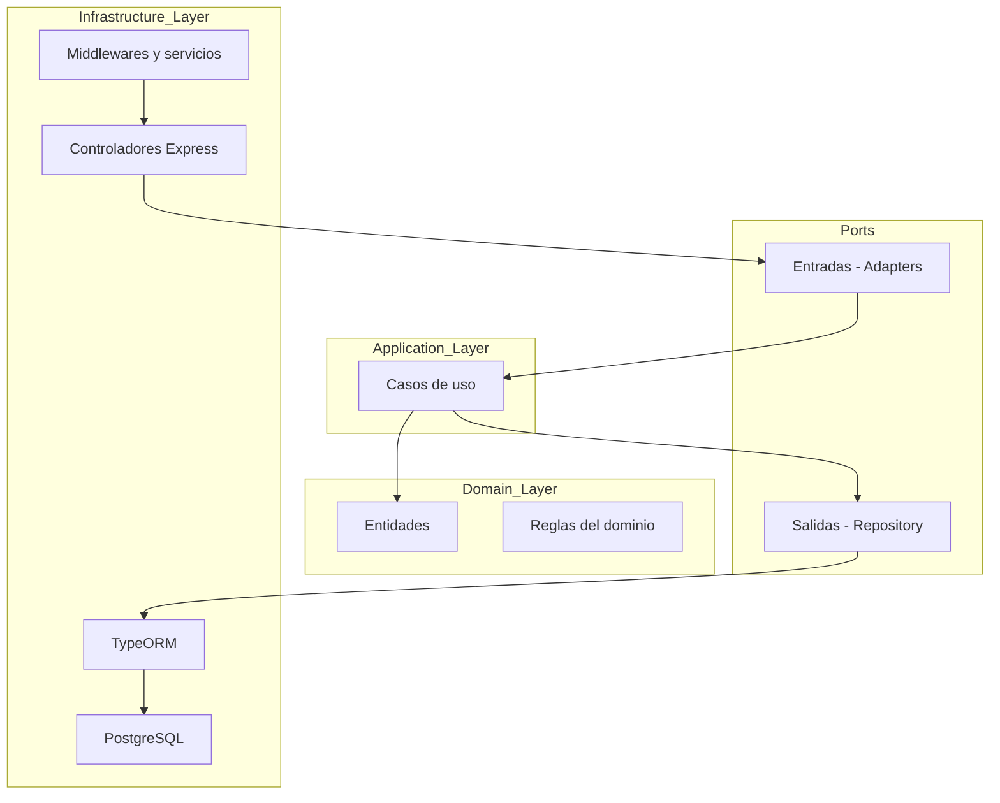

# 🏧 Cajero Virtual Backend

Este proyecto simula el funcionamiento de un cajero automático (ATM) con Express.js y PostgreSQL, permitiendo registrar usuarios, iniciar sesión y retirar dinero con entrega simulada de billetes.

## Srack

- TypeScript
- Express.js
- PostgreSQL
- TypeORM
- Clean Architecture + DDD + Hexagonal

## 📊 Diagrama del flujo



Estructura de carptes 
```
└── 📁Back-Cajero
    
    └── 📁src
        └── 📁adapters
        └── 📁domain
        └── 📁Dtos
        └── 📁frameworks
        └── 📁repository
        └── 📁useCases
    ├── .env
    ├── .gitignore
    ├── package.json
    ├── pnpm-lock.yaml
    ├── README.md
    └── tsconfig.json
```


